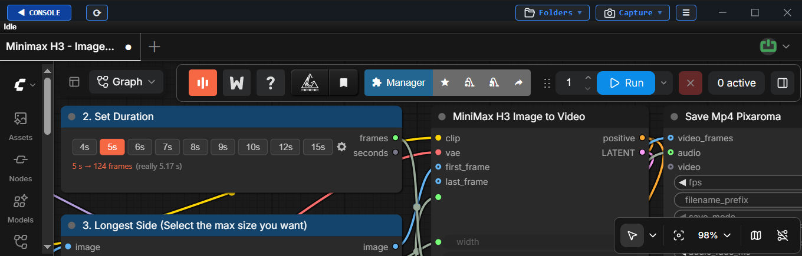

🌍 
<a href="../README.md#english">English</a> |
<a href="README.zh-CN.md#zh-cn">简体中文</a> |
<a href="README.ja.md#ja">日本語</a> |
<a href="README.ko.md#ko">한국어</a> |
<a href="README.es.md#es">Español</a> |
<a href="README.pt-BR.md#pt-br">Português</a> |
<a href="README.de.md#de">Deutsch</a> |
<a href="README.fr.md#fr">Français</a> |
<a href="README.ru.md#ru">Русский</a> |
<strong>Türkçe</strong> |
<a href="README.vi.md#vi">Tiếng Việt</a>

---

# ComfyUI-Easy-Install
**Windows** 🔹 Nvidia GPU'lar için tek tıklamayla taşınabilir **ComfyUI** kurucusu  

**Pixaroma** ekibine adanmıştır  

ComfyUI-Easy-Install, tek tıklamayla tamamen yapılandırılmış ve taşınabilir bir ComfyUI'dir. Python kurulumu yok, manuel bağımlılık yok.

## 📦 Dahil Edilen Bileşenler

<b>Temel Bileşenler</b>

| 🔧 Bileşen | 📝 Not |
|---|---|
| [Git](https://git-scm.com/) |  - En son sürüm (gerekirse kurulacak/güncellenecek) |
| [Python](https://www.python.org/downloads/release/python-31210/) |  - Embedded sürüm |
| [ComfyUI](https://github.com/Comfy-Org/ComfyUI) |  - En son sürüm |

<b>Pixaroma eğitimlerinden node'lar</b>

| 🖼️ Görüntü | 🎬 Video | 🎵 Ses | 🧩 Yardımcı / WF | 🤖 Modeller |
|---|---|---|---|---|
| [Tiled Diffusion & VAE](https://github.com/shiimizu/ComfyUI-TiledDiffusion) | [VideoHelperSuite](https://github.com/Kosinkadink/ComfyUI-VideoHelperSuite) | [MelBandRoFormer](https://github.com/kijai/ComfyUI-MelBandRoFormer) | [ComfyUI Manager](https://github.com/Comfy-Org/ComfyUI-Manager) | [QwenVL](https://github.com/1038lab/ComfyUI-QwenVL) |
| [Inpaint CropAndStitch](https://github.com/lquesada/ComfyUI-Inpaint-CropAndStitch) | [WanVideoWrapper](https://github.com/kijai/ComfyUI-WanVideoWrapper) | [Qwen3-TTS](https://github.com/flybirdxx/ComfyUI-Qwen-TTS) | [Easy-Use](https://github.com/yolain/ComfyUI-Easy-Use) | [GGUF](https://github.com/city96/ComfyUI-GGUF) |
| [ControlNet Aux](https://github.com/Fannovel16/comfyui_controlnet_aux) | [WanAnimatePreprocess](https://github.com/kijai/ComfyUI-WanAnimatePreprocess) | [FishAudioS2](https://github.com/Saganaki22/ComfyUI-FishAudioS2) | [KJNodes](https://github.com/kijai/ComfyUI-KJNodes) | |
| [LayerStyle](https://github.com/chflame163/ComfyUI_LayerStyle) | [SeedVR2 VideoUpscaler](https://github.com/numz/ComfyUI-SeedVR2_VideoUpscaler) | | [rgthree](https://github.com/rgthree/rgthree-comfy) | |
| [RMBG](https://github.com/1038lab/ComfyUI-RMBG) | | | [iTools](https://github.com/MohammadAboulEla/ComfyUI-iTools) | |
| [Easy-Sam3](https://github.com/yolain/ComfyUI-Easy-Sam3) | | | [ControlAltAI Nodes](https://github.com/gseth/ControlAltAI-Nodes) | |
| [SCAIL-Pose](https://github.com/kijai/ComfyUI-SCAIL-Pose) | | | ✨[Pixaroma](https://github.com/pixaroma/ComfyUI-Pixaroma) | |

<b>İsteğe Bağlı Ek Node'lar ve Araçlar</b>

| 🧩 Node'lar | 🛠️ Araçlar |
|---|---|
| [Nunchaku](https://github.com/nunchaku-ai/nunchaku) | Easy-Models-Linker |
| [SageAttention (v2.2.0 and v3)](https://github.com/woct0rdho/SageAttention) | Easy-System-Checker |
| [FlashAttention](https://github.com/Dao-AILab/flash-attention) | ComfyUI-Version-Switcher |
| [InsightFace](https://github.com/deepinsight/insightface) | Easy-model2GGUF |
| [Trellis 2.0](https://github.com/visualbruno/ComfyUI-Trellis2) | Long-Paths-Enabler |
| | Torch-Pack |
| | Toggle-DynamicVRAM |
| | Update Easy-Install |

---

## 🖥️ Windows Kurulumu
1. [**▶️ BURAYA TIKLAYIN ◀️**](https://github.com/Tavris1/ComfyUI-Easy-Install/releases/latest/download/ComfyUI-Easy-Install.zip) en son sürümü indirmek için
2. ZIP dosyasını yeni bir klasöre çıkarın ve **`ComfyUI-Easy-Install.bat`** dosyasını çalıştırın
3. Kurulumdan sonra **Add-ons** klasöründen aşağıdaki bileşenleri kurabilir veya çalıştırabilirsiniz:
    - **Easy-Models-Linker** - *Mevcut **MODELS** klasörünü **extra_model_paths.yaml** aracılığıyla kullanır, yeniden indirme gerekmez*
      - *Bazı klasörler (**LLM** ve **llm_gguf** gibi) bu şekilde yönlendirilemez*
    - **Easy-System-Checker** - *Temel donanım ve yazılım bileşenleri hakkında bilgi sağlar*
    - **Nunchaku** - *Nunchaku'yu kurar. (Daha sonra sorun oluşursa `Nunchaku.bat` dosyasını tekrar çalıştırın)*
    - **SageAttention-Multi** - *Hem SageAttention v2.2.0 hem de v3'ü kurar (v3 yalnızca NVIDIA 50 serisi GPU'larda etkilidir)*
    - **FlashAttention** - *FlashAttention v2.8.3'ü kurar*
    - **InsightFace** - *InsightFace'i kurar (Önceden eğitilmiş modeller yalnızca ticari olmayan araştırmalar için)*
    - **Trellis2** - *Trellis 2.0 ve modeli kurar (`Add-ons/Torch-Pack` içindeki `Torch 2.8.0+cu128` gereklidir)*
    - **Torch-Pack** - *Şunlar arasında hızlı geçiş: `Torch 2.7.1+cu128`, `Torch 2.8.0+cu128` ve `Torch 2.9.1+cu130`*
    - **Easy-model2GGUF** - *Modelleri GGUF'a dönüştürür ve quantize eder (Q2_K–Q8_0) ve varsa 5D tensor düzeltmeleri uygular*
    - **Long-Paths-Enabler** - *Windows 10/11'de **Long Paths** özelliğini etkinleştirir. Python/ComfyUI için gereklidir*
    - **ComfyUI-Version-Switcher** - *Sorun durumunda önceki bir ComfyUI sürümüne **geri döndürme** (reversible)*
    - **Toggle-DynamicVRAM** - *ComfyUI başlangıç dosyalarındaki **--disable-dynamic-vram** seçeneğini açıp kapatır*
    - **Update Easy-Install** - ***Add-ons** ve diğer klasörleri günceller. Masaüstü kısayolları oluşturur*
> [!IMPORTANT]
> - Kurucuyu **Administrator** olarak çalıştırmayın.
> - Sistem klasörlerinden kaçının (`Program Files`, `Windows`, `C:\` kökü).
> - Klasör adlarında boşluk ve özel karakterlerden kaçının.
> - NVIDIA sürücülerinizin güncel olduğundan emin olun.

> [!TIP]
> - Birden fazla ComfyUI kurulumu çakışma olmadan kullanılabilir.
> - Kurulumdan sonra `ComfyUI-Easy-Install` klasörünü yeniden adlandırabilir/taşıyabilirsiniz.
> - [**macOS / Linux için buraya tıklayın**](https://github.com/Tavris1/ComfyUI-Easy-Install/tree/MAC-Linux)

## ❤️ Bana Destek Olun

Projelerimi beğeniyor musunuz? Her türlü destek çok takdir edilir!

